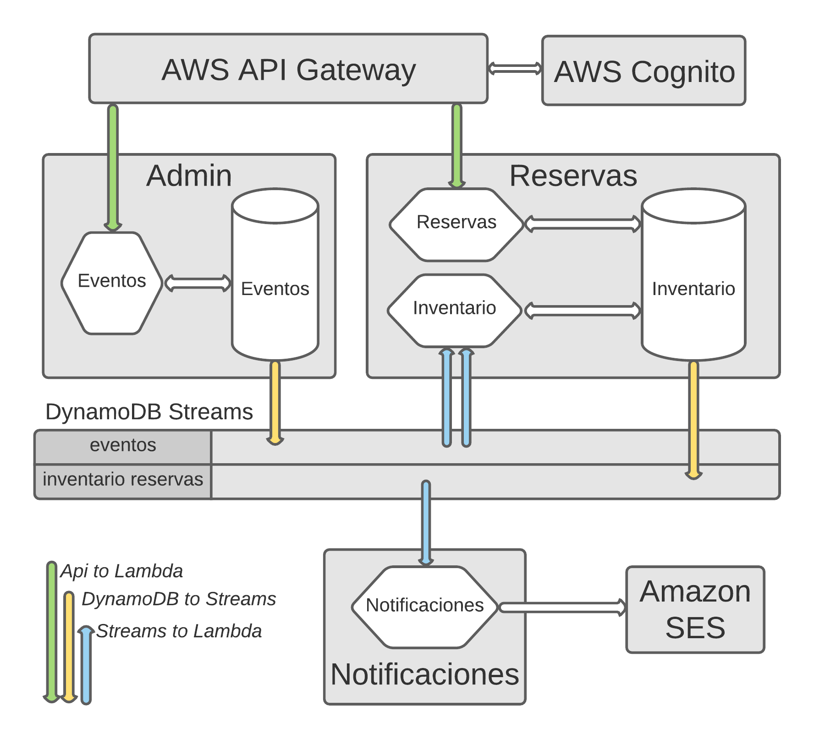

## Prueba de concepto: Boletia, una aplicación para venta de boletos,  basada en microservicios event-driven.

**Desarrollada sobre AWS Serverless: Api Gateway, Lambda, DynamoDB, DynamoDB Streams**


En repositorios anteriores realizamos la prueba de concepto de la aplicación Boletia en un ambiente Kubernetes con Kafka (3 brokers) y MongoDB (3 réplicas).

https://github.com/avaco2312/boletia-kubernetes-kafka-mongodb
https://github.com/avaco2312/kubernetes-kafka-cluster
https://github.com/avaco2312/kubernetes-mongodb-replicaset

El objetivo ahora es realizar una prueba similar, pero soportada esta vez sobre los servicios Serverless de Amazon Web Services. Usaremos los servicios Api Gateway, Lambda, DynamoDB y DynamoDB Streams.

Los puntos de entrada del backend Boletia serán los mismos, lo que ahora el acceso es a través de Api Gateway, conectados a funciones Lambda. Los datos estarán soportados sobre DynamoDB.

En el esquema del inicio ahora los cilindros son tablas de DynamoDB y los hexágonos conjunto de funciones Lambda. Para la comunicación entre los microservicios, en lugar de Kafka,  usamos ahora DynamoDB Streams, que disparan funciones Lambda.

El esquema del Api Gateway definido está en apiGateway/Boletia-produccion-oas30-apigateway.yaml. Describamos los puntos de llamada del backend:

Dominio Eventos.

Como en el repositorio anterior, este dominio gestiona los eventos y mediante llamadas a funciones Lambda actualiza la tabla evento, cuya estructura es:

- PK (partition key): string, es el nombre del evento.
- Estado: string ("A" activa o "C" cancelada)
- Capacidad: int (capacidad del evento)
- Categoría: string ("Rock", "Opera", "Fútbol", ...)

El código de las funciones Lambda en /eventos.

| Endpoint          | Método | Lambda       | Operación DynamoDB | Operación DynamoDB                                   |
| ----------------- | ------ | ------------ | ------------------ | ---------------------------------------------------- |
| /eventos          | GET    | findAll      | Scan               | Recupera todos los eventos                           |
| /eventos/{Evento} | GET    | findOne      | getItem            | Recupera el evento "Evento"                          |
| /eventos          | POST   | insertEvento | putItem            | Crea un evento, estado activo "A" (datos en el body) |
| /eventos/{Evento} | DELETE | cancelEvento | updateItem         | Cancela el evento "Evento" (cambia el estado a "C")  |

Podemos hacer las llamadas correspondientes en Api Gateway (una vez todo implementado), por ejemplo, crear un evento:

```code
curl -X POST https://oy7rgdejtk.execute-api.us-west-2.amazonaws.com/produccion/eventos
-d '{
        "evento":   "Opera Aida",
        "capacidad": 30,
        "categoria": "Opera"
    }'

HTTP/1.1 200 OK
Date: Mon, 06 Dec 2021 02:01:51 GMT
Content-Type: application/json
Content-Length: 88
Connection: close
x-amzn-RequestId: 4980b4df-ac94-46e4-89d7-979dd0306318
x-amz-apigw-id: J55KcH5jPHcFfhA=
X-Amzn-Trace-Id: Root=1-61ad6f0f-730fe2865d948c584057812b;Sampled=0
{
  "Evento": "Opera Aida",
  "Capacidad": 30,
  "Categoria": "Opera",
  "Estado": "A"
}
```

La creación de las tablas la hacemos con un programa independiente, en /initdb, que corremos desde nuestra computadora. Al crear la tabla eventos hemos definido, además de su estructura, que tenga habilitado DynamoDB Stream. Esto significa que al modificar un registro en eventos, se generará un registro en el stream, que podemos procesar con funciones Lambda.

Tenemos dos funciones Lambda asociadas al stream de eventos (se disparan al modificar eventos). Las hemos ubicado como parte del dominio Reservas porque propagan los cambios de la tabla eventos a la tabla inventario, que es el soporte de este dominio. El código en /reservas.

La función modificaInventarioEvento se encarga de reproducir los cambios de la tabla eventos (creación y cancelación) en la tabla inventario. La función modificaInventarioReserva la veremos más adelante.

Dominio Reservas:

Empecemos viendo la estructura de la tabla inventario. Esta sigue el diseño, muy común en DynamoDB, de "una sola tabla". Contiene dos tipos de registros:

- Eventos: La copia, creada y actualizada automáticamente desde la tabla eventos, a través del stream-lambda antes mencionado.
- Reservas: Los datos de las reservas que se creen mediante los puntos de acceso del Api Gateway.

La estructura es:

- PK (partition key): string, "E", cuando el registro es un evento, "I" cuando es una reserva (id de la reserva)
- SK (sort key): string, cuando PK es "E", el nombre de la reserva; cuando PK es I, la id de la reserva.
- Cuando PK es "E", los campos que se registran son los de un evento (Estado, Capacidad y Categoría). Al igual que en el repositorio anterior aquí interpretaremos la Capacidad como Disponibilidad".
- Cuando PK es "I" se registran los datos de una reserva, que son Evento, Email (del cliente), Estado (de la reserva) y Cantidad (de boletos comprados)

Un ejemplo de inventario sería:

| PK  | SK                          | Estado | Capacidad | Categoría | Evento     | Cantidad | Email           |
| --- | --------------------------- | ------ | --------- | --------- | ---------- | -------- | --------------- |
| E   | Opera Aida                  | A      | 30        | Opera     |            |          |                 |
| I   | 21tBsOlzrdXa73UNotTK0nXIAm7 | A      |           |           | Opera Aida | 3        | pepe@gmail.com  |
| I   | 21tC9y2lJr3Aj1RQu6miT5usxf0 | X      |           |           | Opera Aida | 1        | juan@gmail.com  |
| E   | Queen Live                  | C      | 500       | Rock      |            |          |                 |
| I   | 21tCLy6Y7EvxXEwMt4fzGJJccsc | C      |           |           | Queen Live | 30       | maria@gmail.com |

Para ofrecer las posibilidades de consulta que requerirá el frontend, se define para la tabla inventario un índice secundario global, evento-email, cuya partition key  es el campo Evento y la sort key Email.

Las llamadas para el dominio Reservas son:

| Endpoint                   | Método | Lambda                  | Operación DynamoDB        | Operación DynamoDB                                                |
| -------------------------- | ------ | ----------------------- | ------------------------- | ----------------------------------------------------------------- |
| /reservas/eventos          | GET    | findAllEventos          | Query                     | Recupera todos los eventos (en inventario)                        |
| /reservas/eventos/{Evento} | GET    | findOneEvento           | getItem                   | Recupera el evento "Evento" (en inventario)                       |
| /reservas/{Evento}/{Email} | GET    | findReservasEventoEmail | Query (índice secundario) | Recupera las reservas del cliente "Email" para el evento "Evento" |
| /reservas/{Id}             | GET    | findReservaId           | getItem                   | Recupera la reserva con id "Id"                                   |
| /reservas                  | POST   | insertReserva           | TransactWriteItems        | Crea una reserva, estado "A" (datos en el body)                   |
| /reservas/{Id}             | DELETE | cancelReserva           | TransactWriteItems        | Cancela la reserva con id "Id", estado "X"                        |

En este repositorio hemos aprovechado la operación de DynamoDB TransactWriteItems para actualizar, de forma consistente y simultánea, la disponibilidad del evento y el registro de la reserva, ambos en la tabla inventario, tanto al crear como al cancelar una reserva. Al crear se registra la reserva como activa y se disminuye la disponibilidad del evento por el número de boletos comprados. Al cancelar el estado de la reserva se cambia a "X" y se aumenta la disponibilidad del evento con los boletos liberados.

Hagamos algunas operaciones de ejemplo:

- Listar los eventos disponibles en inventario (creados automáticamente desde eventos):

```code
curl -X GET https://oy7rgdejtk.execute-api.us-west-2.amazonaws.com/produccion/reservas/eventos

HTTP/1.1 200 OK
Date: Mon, 06 Dec 2021 03:32:02 GMT
Content-Type: application/json
Content-Length: 206
Connection: close
x-amzn-RequestId: 7176fffb-99c9-4ce5-8752-aa8170d84e16
x-amz-apigw-id: J6GX6FuOPHcFc8g=
X-Amzn-Trace-Id: Root=1-61ad8432-1e92e4331ae4f8407cc485fa;Sampled=0
[
  {
    "Evento": "Opera Aida",
    "Capacidad": 30,
    "Categoria": "Opera",
    "Estado": "A"
  }
]
```
- Hacer unas reservas:

```code
curl -X POST  https://oy7rgdejtk.execute-api.us-west-2.amazonaws.com/produccion/reservas
-d '{
        "evento":   "Opera Aida",
        "cantidad": 1,
        "email": "avaco.digital@gmail.com"
    }' 

HTTP/1.1 200 OK
Date: Mon, 06 Dec 2021 03:34:04 GMT
Content-Type: application/json
Content-Length: 139
Connection: close
x-amzn-RequestId: 24402507-93be-408c-a0a1-d8ab4a639165
x-amz-apigw-id: J6Gq2HSMPHcFneQ=
X-Amzn-Trace-Id: Root=1-61ad84ab-0d3b111b263d4e5250e3bdc8;Sampled=0
{
  "Id": "21tY2WfhKPDj0TDulNRlu2yszl4",
  "Evento": "Opera Aida",
  "Estado": "A",
  "Email": "avaco.digital@gmail.com",
  "Cantidad": 1
}

curl -X POST  https://oy7rgdejtk.execute-api.us-west-2.amazonaws.com/produccion/reservas
-d '{
        "evento":   "Opera Aida",
        "cantidad": 10,
        "email": "pepe@gmail.com"
    }' 

HTTP/1.1 200 OK
Date: Mon, 06 Dec 2021 03:36:15 GMT
Content-Type: application/json
Content-Length: 139
Connection: close
x-amzn-RequestId: 99dbb1e2-3d35-49a8-8ace-56cc11db6d5a
x-amz-apigw-id: J6G_hHruvHcFeHg=
X-Amzn-Trace-Id: Root=1-61ad852f-3e095c387c3e2c752b3afb1c;Sampled=0
{
  "Id": "21tYJ9WFytF1KRq73EtsGjWrUE4",
  "Evento": "Opera Aida",
  "Estado": "A",
  "Email": "pepe.digital@gmail.com",
  "Cantidad": 10
}
```
- Cancelar una reserva (Id):

```code
curl -X DELETE https://oy7rgdejtk.execute-api.us-west-2.amazonaws.com/produccion/reservas/21tYJ9WFytF1KRq73EtsGjWrUE4

HTTP/1.1 200 OK
Date: Mon, 06 Dec 2021 03:40:09 GMT
Content-Type: text/html
Content-Length: 48
Connection: close
x-amzn-RequestId: 8ec390f8-eb40-4761-b107-1da014e88732
x-amz-apigw-id: J6Hj8HNUPHcFlMg=
X-Amzn-Trace-Id: Root=1-61ad8619-337be8972d6ab9af31f39342;Sampled=0

Reserva Id 21tYJ9WFytF1KRq73EtsGjWrUE4 cancelada
```

- Ver la reserva (cancelada):

```code
curl -X GET https://oy7rgdejtk.execute-api.us-west-2.amazonaws.com/produccion/reservas/21tYJ9WFytF1KRq73EtsGjWrUE4

HTTP/1.1 200 OK
Date: Mon, 06 Dec 2021 03:40:33 GMT
Content-Type: application/json
Content-Length: 139
Connection: close
x-amzn-RequestId: ce2e6688-ef63-45fc-b0a9-7fb7b8f62437
x-amz-apigw-id: J6HnpHuNPHcFxAg=
X-Amzn-Trace-Id: Root=1-61ad8630-02ba5c2977ed98660ee681e4;Sampled=0
{
  "Id": "21tYJ9WFytF1KRq73EtsGjWrUE4",
  "Evento": "Opera Aida",
  "Estado": "X",
  "Email": "pepe.digital@gmail.com",
  "Cantidad": 10
}
```

- Verificar la disponibilidad del evento:

```code
curl -X GET https://oy7rgdejtk.execute-api.us-west-2.amazonaws.com/produccion/reservas/eventos

HTTP/1.1 200 OK
Date: Mon, 06 Dec 2021 03:42:02 GMT
Content-Type: application/json
Content-Length: 206
Connection: close
x-amzn-RequestId: 7176fffb-99c9-4ce5-8752-aa8170d84e16
x-amz-apigw-id: J6GX6FuOPHcFc8g=
X-Amzn-Trace-Id: Root=1-61ad8432-1e92e4331ae4f8407cc485fa;Sampled=0
[
  {
    "Evento": "Opera Aida",
    "Capacidad": 29,
    "Categoria": "Opera",
    "Estado": "A"
  }
]
```
Mencionamos que el stream correspondiente a la tabla eventos dispara dos funciones Lambda, que hemos considerado parte del Dominio Reservas. Vimos que modificaInventarioEvento se encarga de duplicar el evento creado en la tabla eventos en la tabla inventario (lo crea con estado "A" y si se cancela lo pasa a estado "C".

La otra función, modificaInventarioReserva, también procesa el stream y se encarga de,  cuando los administradores cancelan un evento, pasar a estado "C" todas las reservas de ese evento que estén activas (igual que en el repositorio anterior, una reserva puede tener estado "A" activa, "C" cancelado el evento por los organizadores ó "X" cancelada la reserva por el cliente).

Cómo DynamoDB no admite "update en masa" se realiza en partes:

- Si el evento del stream es una cancelación de evento, se procesa.
- Un Query por el índice secundario evento-email, de la tabla inventario, busca todas las reservas activas correspondientes a ese evento (solo especifica el evento y recupera todos los email).
- Para cada una de estas reservas se recupera su Id y con la clave completa (PK "I" y SK Id), se hace un update de la reserva en inventario, poniendo el campo Estado en "C".

Probemos a cancelar un evento en la tabla eventos:

```code
curl -X DELETE https://oy7rgdejtk.execute-api.us-west-2.amazonaws.com/produccion/eventos/Opera%20Aida

HTTP/1.1 200 OK
Date: Mon, 06 Dec 2021 03:43:14 GMT
Content-Type: text/html
Content-Length: 27
Connection: close
x-amzn-RequestId: 27321321-391b-4fb3-bc7f-2102047340a2
x-amz-apigw-id: J6IAyFPPPHcF44A=
X-Amzn-Trace-Id: Root=1-61ad86d1-41cb4cce0c01aa765cf0c8bf;Sampled=0

Evento Opera Aida cancelado

curl -X GET https://oy7rgdejtk.execute-api.us-west-2.amazonaws.com/produccion/reservas/21tY2WfhKPDj0TDulNRlu2yszl4

HTTP/1.1 200 OK
Date: Mon, 06 Dec 2021 03:47:30 GMT
Content-Type: application/json
Content-Length: 139
Connection: close
x-amzn-RequestId: a13236f5-1b26-4be5-a994-5e966a96c761
x-amz-apigw-id: J6Io4GiJvHcFS6g=
X-Amzn-Trace-Id: Root=1-61ad87d2-52221c1d7683a12b3c82c82f;Sampled=0
{
  "Id": "21tY2WfhKPDj0TDulNRlu2yszl4",
  "Evento": "Opera Aida",
  "Estado": "C",
  "Email": "avaco.digital@gmail.com",
  "Cantidad": 1
}
```

Los eventos que estaban activos pasan a "C", cancelado el evento por los organizadores. Los que habían sido cancelados por el usuario siguen en estado "X".

El último dominio de la aplicación es Notificaciones. Igual que en el repositorio anterior envía automáticamente email al cliente sobre el estado de sus reservas. Para ello la tabla inventario también se crea con DynamoDB Stream habilitado.

Este stream se conecta a la función lambda notificaciones. Esta desecha los cambios en la tabla inventario que no se refieren a reservas (cuando se crea o cancela un evento). Con sólo los cambios que se refieren a reservas, envía el correspondiente mensaje usando el servicio AWS SES (los posibles tipos: creación de la reserva "A", cancelación por el usuario "X" ó cancelación del evento "C")

Los emails serían como:

```code
Su reserva 21tY2WfhKPDj0TDulNRlu2yszl4 de 1 boletos para el evento Opera Aida está confirmada

Su reserva 21tC9y2lJr3Aj1RQu6miT5usxf0 de 3 boletos para el evento Opera Aida fue cancelada a petición suya

Su reserva 21tY2WfhKPDj0TDulNRlu2yszl4 de 1 boletos para el evento Opera Aida fue cancelada, el evento fue suspendido por los organizadores
```

Todo el deploy de Boletia en AWS pudiera hacerse automáticamente. Aquí lo hemos hecho mediante la consola AWS web. A lo mejor en un próximo proyecto lo presentamos, así como proteger nuestra API con Cognito, etc. Pero por el momento, habría muchos detalles por ver, pero uno resalta por su importancia: los permisos. A todas las funciones lambda que usamos hay que concederle los permisos que necesitan. Sin entrar en los detalles:

- Todas necesitan el permiso básico de ejecución, mediante la política AWSLambdaBasicExecutionRole.
- A las que son llamadas por API Gateway hay que agregarle los permisos para las operaciones de DynamoDB que ejecuten. Por ejemplo, para la función findReservaId una política adicional expresada por :

```code
{
    "Version": "2012-10-17",
    "Statement": [
        {
            "Sid": "VisualEditor0",
            "Effect": "Allow",
            "Action": "dynamodb:GetItem",
            "Resource": "arn:aws:dynamodb:us-west-2:440939667227:table/inventario"
        }
    ]
}
```

- Hemos restringido estas políticas adicionales a las operaciones y recursos mínimos requeridos por cada función.
- Las funciones lambda que se ejecutan conectadas a DynamoDB Stream necesitan la política AWSLambdaDynamoDBExecutionRole, en adición a las otras mencionadas.
- A la función lambda notificaciones,que envía email mediante AWS SES, se le agrega:

```code
{
    "Version": "2012-10-17",
    "Statement": [
        {
            "Sid": "VisualEditor0",
            "Effect": "Allow",
            "Action": "ses:SendEmail",
            "Resource": [
                "arn:aws:ses:*:440939667227:configuration-set/*",
                "arn:aws:ses:*:440939667227:identity/*"
            ]
        }
    ]
}
```

También es necesario, para las funciones lambda que procesan streams, definir un disparador que la conecte a la tabla dynamodb que corresponda.


